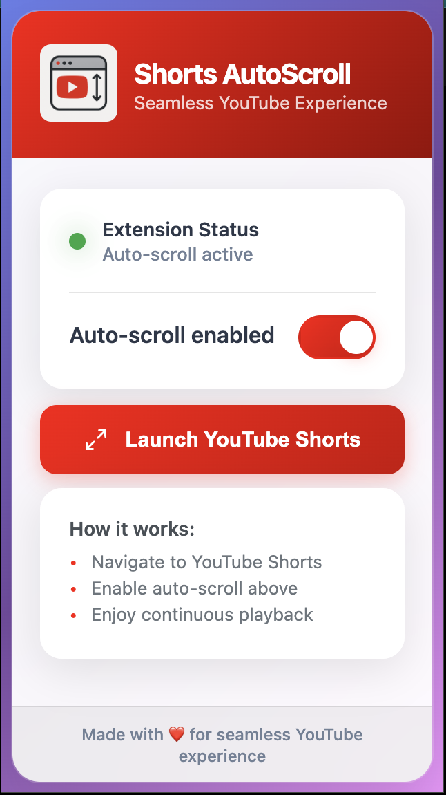

# 🎬 YouTube Shorts Auto-Scroll Chrome Extension

<div align="center">


**Seamless YouTube Shorts Experience with Automatic Scrolling**

</div>

---

## 📋 Overview

Transform your YouTube Shorts browsing experience with intelligent auto-scrolling! This Chrome extension automatically advances to the next Short when the current video ends, creating a seamless, hands-free viewing experience.

Perfect for background entertainment, content discovery, and productivity enthusiasts who want uninterrupted YouTube Shorts playback.



## ✨ Features

### 🎯 **Core Functionality**

- **Smart Video Detection** - Intelligently detects when you're on YouTube Shorts
- **Automatic Scrolling** - Seamlessly advances to next Short when current video ends
- **Multiple Detection Methods** - Robust video end detection with fallback mechanisms
- **Instant Toggle** - Easy on/off control via beautiful popup interface

### 🎨 **User Experience**

- **Beautiful UI** - Modern glassmorphism design with smooth animations
- **Visual Feedback** - Real-time status indicators and notifications
- **Persistent Settings** - Remembers your preferences across sessions
- **Error Recovery** - Built-in retry logic for maximum reliability

### 🔧 **Technical Features**

- **Lightweight** - Minimal resource usage and fast performance
- **Privacy-Focused** - No data collection, works entirely locally
- **Cross-Session** - Maintains functionality across YouTube navigation
- **Fallback Methods** - Multiple scrolling techniques for reliability

## 🚀 Installation

### From Chrome Web Store (Recommended)

1. Visit the [Chrome Web Store page](https://chrome.google.com/webstore) _(coming soon)_
2. Click "Add to Chrome"
3. Confirm installation
4. Start using immediately!

### Manual Installation (Development)

1. **Clone the repository**

   ```bash
   git clone https://github.com/veerprakash28/youtube-shorts-autoscroller.git
   cd youtube-shorts-autoscroll
   ```

2. **Load in Chrome**

   - Open Chrome and navigate to `chrome://extensions/`
   - Enable "Developer mode" (top right toggle)
   - Click "Load unpacked"
   - Select the extension folder

3. **Start using**
   - Extension icon appears in Chrome toolbar
   - Navigate to YouTube Shorts and toggle auto-scroll!

## 🎮 Usage

### Quick Start

1. **Click the extension icon** in your Chrome toolbar
2. **Toggle "Auto-Scroll"** to enable automatic scrolling
3. **Navigate to YouTube Shorts** or click "Launch YouTube Shorts"
4. **Enjoy seamless playback** as videos automatically advance!

### Interface Overview

- **Status Indicator** - Shows current extension state
- **Auto-Scroll Toggle** - Enable/disable functionality
- **Quick Launch** - Direct link to YouTube Shorts
- **Statistics** - Track your viewing activity

## 🏗️ Architecture

### How It Works

#### 1. **Background Service** (`background.js`)

- Monitors tab changes and YouTube navigation
- Manages extension lifecycle and settings
- Handles first-time installation setup

#### 2. **Content Script** (`content.js`)

- Injected into YouTube pages
- Detects video playback state
- Implements multiple scrolling methods:
  - Smooth scrolling via `window.scrollBy()`
  - Button clicking fallback
  - Keyboard simulation backup

#### 3. **Popup Interface** (`popup.html/css/js`)

- Beautiful glassmorphism design
- Real-time status updates
- Settings management
- Usage statistics

#### 4. **Detection Methods**

- **Video Event Listeners** - `ended` and `timeupdate` events
- **Periodic Status Checking** - Regular video state monitoring
- **Scroll Position Tracking** - Detects manual navigation
- **DOM Mutation Observation** - Handles dynamic content loading

## 🛠️ Development

### Prerequisites

- Chrome browser
- Basic knowledge of JavaScript, HTML, CSS
- Understanding of Chrome Extension APIs

### Setup Development Environment

```bash
# Clone repository
git clone https://github.com/veerprakash28/youtube-shorts-autoscroller.git
cd youtube-shorts-autoscroller

# Load extension in Chrome
# 1. Open chrome://extensions/
# 2. Enable Developer mode
# 3. Click "Load unpacked"
# 4. Select project folder
```

### Development Workflow

1. **Make changes** to source files
2. **Reload extension** in `chrome://extensions/`
3. **Test on YouTube Shorts** pages
4. **Debug using** Chrome DevTools
5. **Iterate and improve**

## 🔗 Links

- **Chrome Web Store**: _Coming Soon_
- **GitHub Repository**: [View Source Code](https://github.com/veerprakash28/youtube-shorts-autoscroller)

---
